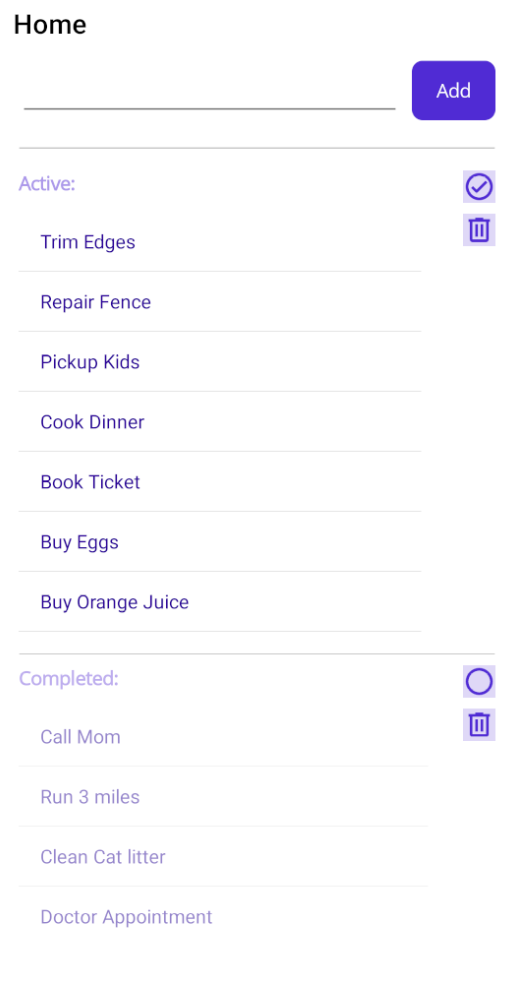
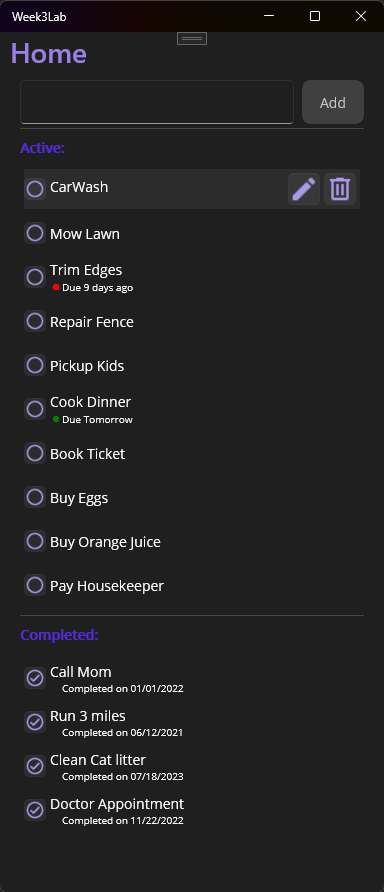

# Week3Lab

In this Lab you will be Modifying the application to provide the following:
1) Add two buttons on the right side of the Active Todos list. One button will be labeled "Complete" and the other "Delete".
2) When the "Complete" button is clicked, the todo should be moved to the Completed Todos list.
3) When the "Delete" button is clicked, the todo should be removed from the list.
4) Add a button to the Completed Todos list labeled "Delete". When clicked, the todo should be removed from the list.
5) Add a button to the Completed Todos list labeled "Activate". When clicked, the todo should be moved back to the Active Todos list.

## Getting Started
Find great icons and images at: https://pictogrammers.com/library/mdi/

## Suggestion using ImageButton

## Solution proposed with ImageButton in the Items Template
